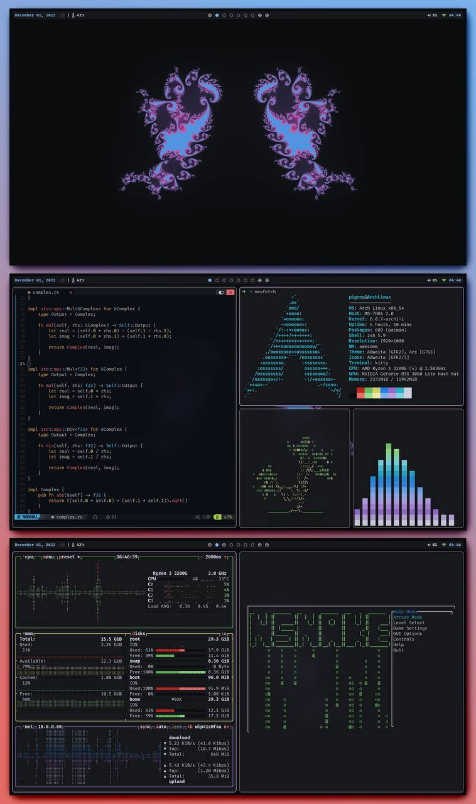

# dots

[installation instructions](https://github.com/joepigott/dots/blob/main/install.md)

my dotfiles. they are guaranteed to be horribly written and very poorly documented but they're here.

i'm planning on ditching polybar for wibar, dunst for naughty, etc. most of the rice is going to end up coming from awesome in the future.

if you run into any problems, feel free to open an issue and i will more than likely not get to it but i will try. :)

update: semester started, progress will be unbearably slow.

