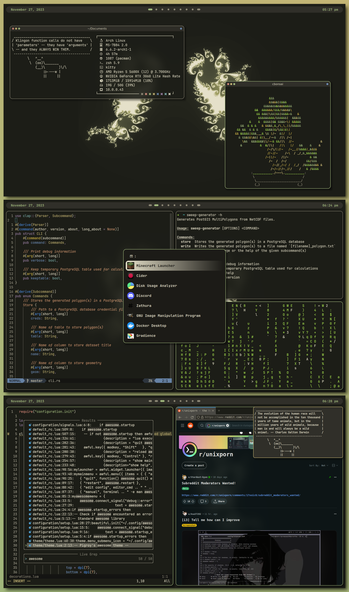

# dots

[installation instructions](https://github.com/joepigott/dots/blob/main/install.md)

my dotfiles. they are guaranteed to be horribly written and very poorly 
documented but they're here.

the awesome config is recently refactored (doesn't mean it's good). polybar has been
ditched for wibar, dunst for naughty, etc. there are very few dependencies when it
comes to the core of the rice.

if you run into any problems, feel free to open an issue and i will more than 
likely not get to it but i will try. :)

